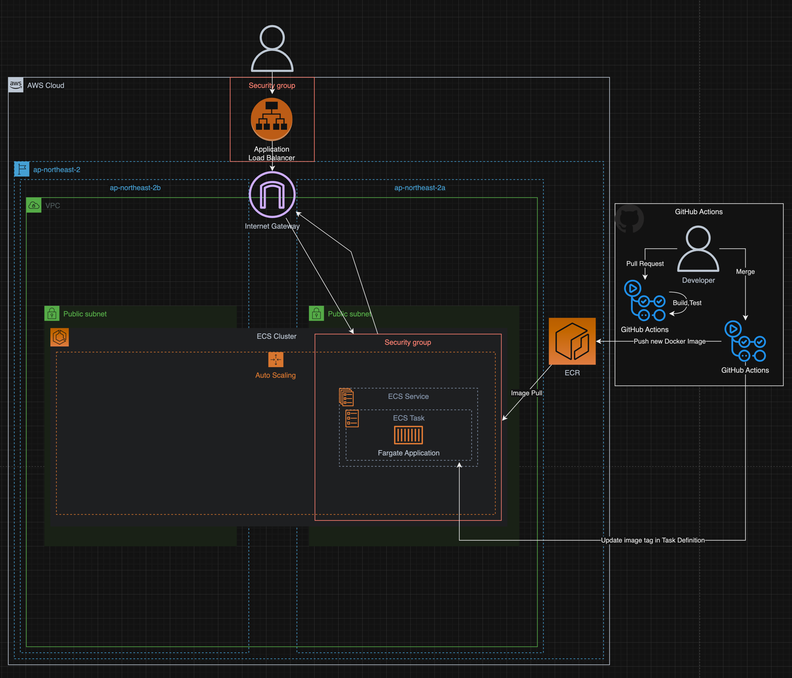
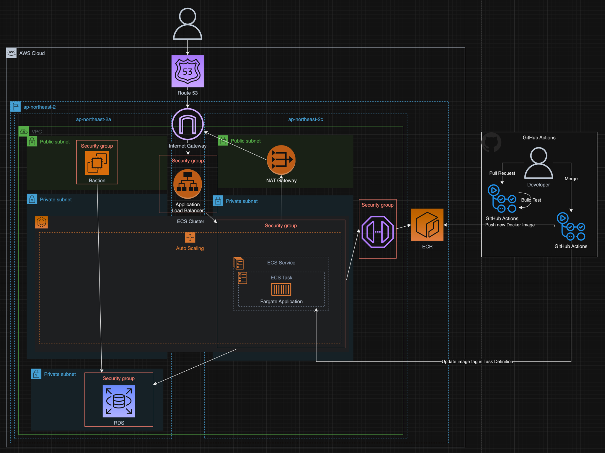

# 항해+

## 1주차 과제 CI/CD 구성

### Github Actions
#### 장점
* 쉽게 무료로 CI/CD를 구축할 수 있다.

#### 단점
* Detail한 설정이 아쉬웠다.
    * ECR에 이미지를 업로드하는 것 까지는 쉽게 구축할 수 있지만.
      운영에 배포할 때 롤백 & 이전 환경(stage)에서 성공적으로 배포된 이미지 선택 등
      원하는 이미지 태그를 선택해서 배포하는 것이 어려웠다.

### Infra Architecture
#### - **AS-IS**

#### - **TO-BE**

